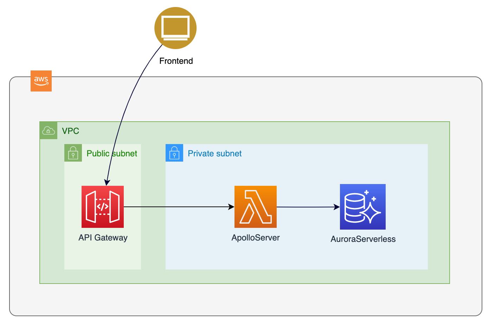

# Architecture

1. [Home](../README.md)
2. Architecture
3. [DevOps](devops.md)
4. [Using](using.md)
6. [GraphQL API](graphql.md)
7. [Roadmap](roadmap.md)

The platform was designed as serverless. It can be easily extended with microservices only creating new resolvers that invoke any another external service or integrating with a message broker. AFAIK GraphQL have subscriptions, there is a simple adoption of asyncronous invocations, allowing to build a distributed system, without increase frontend complexity.

To keep in mind a serverless platform, the chosen RDBMS was the Aurora Serverless compatible with PostgreSQL, but with Sequelize is possible change the SQL engine or even adopt another GraphQL datasource to replace for a NoSQL database, just changing or adding the GraphQL resolver and its models.

The GraphQL was built with Apollo Server, deployed in a NodeJS AWS Lambda and distributed by API Gateway. The AWS API Gateway allows adoption of a WAF and to create plans of usage to increse the API security.

[Next - DevOps](devops.md)
