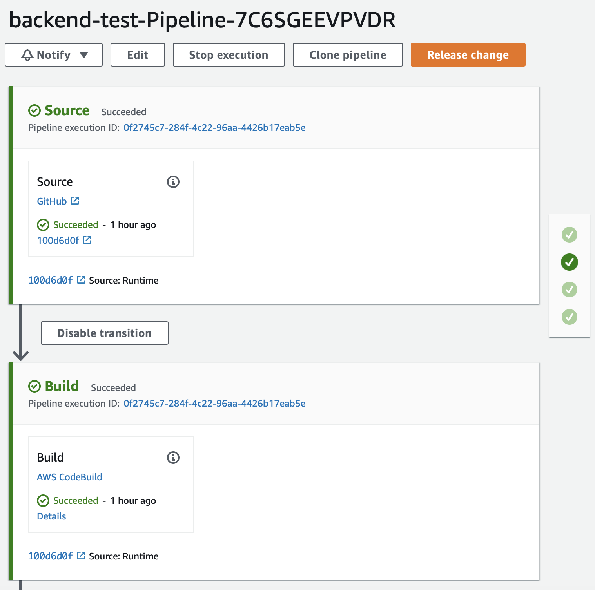
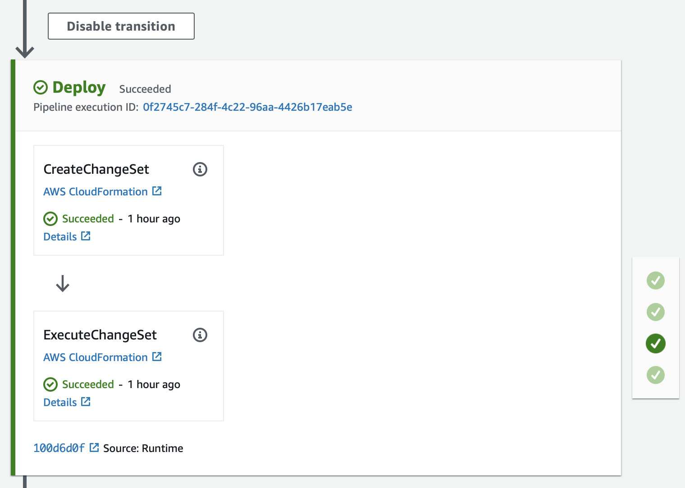
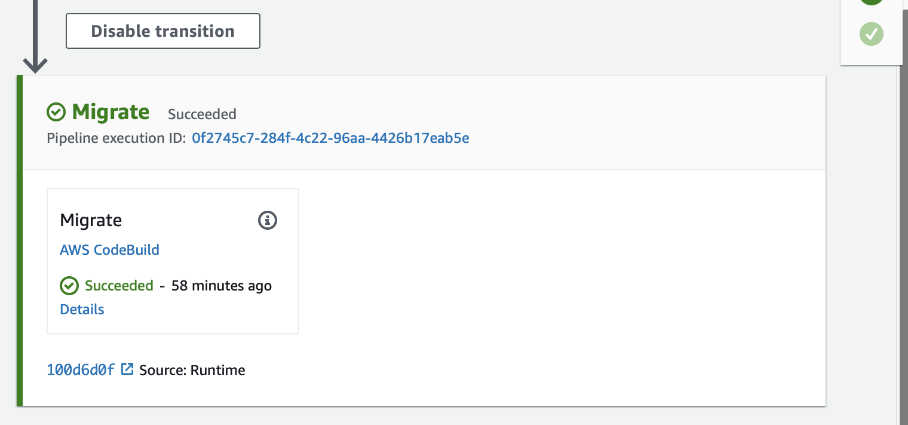

# Documentation

1. [Home](../README.md)
2. [Architecture](architecture.md)
3. DevOps
4. [Using](using.md)
6. [GraphQL API](graphql.md)
7. [Roadmap](roadmap.md)

## IaaS

### AWS SAM

The infrastructure has been built with AWS Serveless Application Model (SAM). The SAM is a CloudFormation model based to build and deploy serverless applications at AWS.

Basically, this projects has been built with a [SAM Template (template.yml)](../iaas/template.yml) which describes all API infrastructure.

### CI/CD

The project also contains a [SAM template (pipeline.yml)](../iaas/pipeline.yml) to deploy the pipelines. This pipeline is reponsible for deploy the SAM with CodeDeploy, creating and executing a ChangeSet (3º action).

The pipeline is started each time that a merge is done in develop (staging) and master branch (production) at Github Repo via WebHook, firing the 1º action Download Source.

The second action build, and test the app, generating a [code coverage report](https://dtelaroli.github.io/backend-test/api/src/coverage/lcov-report/index.html).

The 4º action execute all Sequelize pending migrations.

## Learn more

Consult the [DevOps Test](https://github.com/dtelaroli/devops-test) to lear more about DevOps tools.

[Next - Using](using.md)
