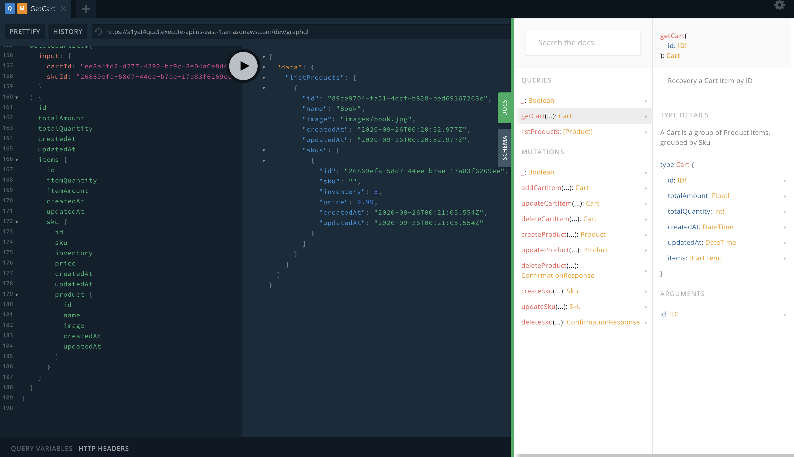

# Documentation

1. [Home](../README.md)
2. [Architecture](architecture.md)
3. [DevOps](devops.md)
4. [Using](using.md)
6. GraphQL API
7. [Roadmap](roadmap.md)

## GraphQL API

A GraphQL API is a REST compatible service which provides to developers build a your own desired interface and pretty tools to understand and test the endpoint.

This API has a built-in playground and documentation available to easy test and learn the data model.



### Playground, schema and documentation

https://a1yat4qcz3.execute-api.us-east-1.amazonaws.com/dev/graphql

### Query examples

```
query GetCart {
  getCart(id: "ee8a4fd2-d277-4292-bf9c-3e04a0e8d45b") {
    id
    totalAmount
    totalQuantity
    createdAt
    updatedAt
    items {
      id
      itemQuantity
      itemAmount
      createdAt
      updatedAt
      sku {
        id
        sku
        inventory
        price
        createdAt
        updatedAt
        product {
          id
          name
          image
          createdAt
          updatedAt
        }
      }
    }
  }
}

query ListProducts {
  listProducts {
    id
    name
    image
    createdAt
    updatedAt
    skus {
      id
      sku
      inventory
      price
      createdAt
      updatedAt
    }
  }
}
```

### Mutation examples

```
mutation CreateProduct {
  createProduct(
    input: {
      id: "89ce9704-fa51-4dcf-b828-bed69167263e"
      name: "Book"
      image: "images/book.jpg"
    }
  ) {
    id
  }
}

mutation CreateSku {
  createSku(
    input: {
      id: "26869efa-58d7-44ee-b7ae-17a83f6269ee"
      sku: "B123"
      inventory: 5
      price: 9.99
      productId: "89ce9704-fa51-4dcf-b828-bed69167263e"
    }
  ) {
    id
  }
}

mutation AddToCart {
  addCartItem(
    input: {
      cartId: "ee8a4fd2-d277-4292-bf9c-3e04a0e8d45b"
      skuId: "26869efa-58d7-44ee-b7ae-17a83f6269ee"
      quantity: 2
    }
  ) {
    id
    totalAmount
    totalQuantity
    createdAt
    updatedAt
    items {
      id
      itemQuantity
      itemAmount
      createdAt
      updatedAt
      sku {
        id
        sku
        inventory
        price
        createdAt
        updatedAt
        product {
          id
          name
          image
          createdAt
          updatedAt
        }
      }
    }
  }
}

mutation UpdateCart {
  updateCartItem(
    input: {
      cartId: "ee8a4fd2-d277-4292-bf9c-3e04a0e8d45b"
      skuId: "26869efa-58d7-44ee-b7ae-17a83f6269ee"
      quantity: 2
    }
  ) {
    id
    totalAmount
    totalQuantity
    createdAt
    updatedAt
    items {
      id
      itemQuantity
      itemAmount
      createdAt
      updatedAt
      sku {
        id
        sku
        inventory
        price
        createdAt
        updatedAt
        product {
          id
          name
          image
          createdAt
          updatedAt
        }
      }
    }
  }
}

mutation DeleteCart {
  deleteCartItem(
    input: {
      cartId: "ee8a4fd2-d277-4292-bf9c-3e04a0e8d45b"
      skuId: "26869efa-58d7-44ee-b7ae-17a83f6269ee"
    }
  ) {
    id
    totalAmount
    totalQuantity
    createdAt
    updatedAt
    items {
      id
      itemQuantity
      itemAmount
      createdAt
      updatedAt
      sku {
        id
        sku
        inventory
        price
        createdAt
        updatedAt
        product {
          id
          name
          image
          createdAt
          updatedAt
        }
      }
    }
  }
}
```

[Next - Roadmap](roadmap.md)
